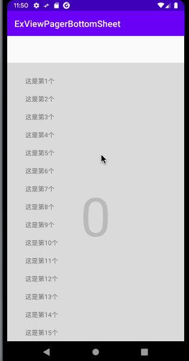

# ExViewPagerBottomSheet

[](https://jitpack.io/#xcc3641/ExViewPagerBottomSheet)

🌟 Help to use ViewPager/ViewPager2 in Bottom Sheet or Bottom Sheet Dialog!

# Demo



# Usage

Add it in your root `build.gradle` at the end of repositories:

```
allprojects {
    repositories {
        ...
        maven { url 'https://jitpack.io' }
    }
}
```

Add the dependency

```
dependencies {
        implementation 'com.github.xcc3641:ExViewPagerBottomSheet:<version>'
}
```

Use `ViewPagerBottomSheetBehavior` for your bottom sheet view:

```
app:layout_behavior="com.imxie.exvpbs.ViewPagerBottomSheetBehavior"
```

Setup ViewPager/ViewPager2:

```
// ViewPager
BottomSheetVPHelper.setupViewPager(vp)

// ViewPager2
BottomSheetVP2Helper.setupViewPager(vp)
```

# Thanks

- [ViewPagerBottomSheet](https://github.com/laenger/ViewPagerBottomSheet)